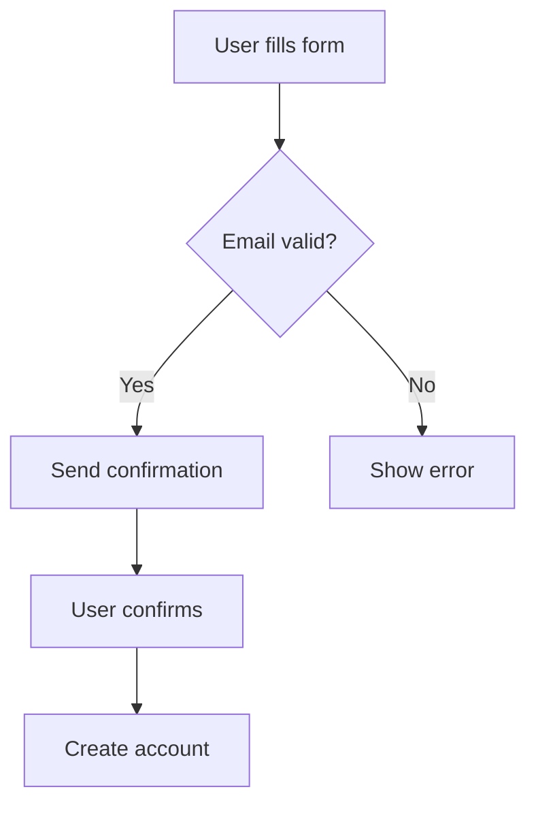

# Diagrams Server — Implementation Spec

## Overview

A dedicated MCP server for generating precise, editable diagrams from natural language descriptions. Unlike the AI image generation tools (which produce raster images), this server outputs structured vector formats (SVG, Mermaid, PlantUML) that can be edited, embedded in docs, and rendered at any resolution.

Crate: `adk-rust-mcp-diagrams`

---

## Why This Is Different

| Feature | whiteboard_generate (AI) | diagrams server |
|---------|--------------------------|-----------------|
| Output format | Raster PNG | SVG, Mermaid, PlantUML |
| Editable | No | Yes (text-based source) |
| Precise layout | Approximate | Exact (algorithmic) |
| Scalable | No (pixels) | Yes (vector) |
| Embeddable in docs | As image | As code block or inline SVG |
| Deterministic | No | Yes (same input = same output) |

---

## Tools

### 1. `diagram_generate`

Generate a diagram from natural language. Uses Gemini to convert description to Mermaid/PlantUML code, then renders to SVG.

| Parameter | Type | Required | Default | Description |
|-----------|------|----------|---------|-------------|
| `description` | string | Yes | — | Natural language description of the diagram |
| `type` | string | No | "auto" | flowchart, sequence, class, state, er, gantt, mindmap, pie, auto |
| `format` | string | No | "svg" | svg, mermaid, plantuml, png |
| `theme` | string | No | "default" | default, dark, forest, neutral |
| `output_file` | string | No | — | Save path |

### 2. `diagram_from_code`

Render a diagram from Mermaid or PlantUML source code directly.

| Parameter | Type | Required | Default | Description |
|-----------|------|----------|---------|-------------|
| `code` | string | Yes | — | Mermaid or PlantUML source |
| `syntax` | string | No | "mermaid" | mermaid, plantuml |
| `format` | string | No | "svg" | svg, png |
| `theme` | string | No | "default" | default, dark, forest, neutral |
| `output_file` | string | No | — | Save path |

### 3. `diagram_to_code`

Convert a natural language description to diagram source code (without rendering).

| Parameter | Type | Required | Default | Description |
|-----------|------|----------|---------|-------------|
| `description` | string | Yes | — | Natural language description |
| `type` | string | No | "auto" | Diagram type hint |
| `syntax` | string | No | "mermaid" | mermaid, plantuml |

---

## Supported Diagram Types

| Type | Use Case | Example |
|------|----------|---------|
| `flowchart` | Process flows, decision trees | CI/CD pipeline, user signup flow |
| `sequence` | API interactions, message flows | OAuth flow, microservice communication |
| `class` | Object models, data structures | Database schema, class hierarchy |
| `state` | State machines, lifecycles | Order status, connection states |
| `er` | Entity-relationship | Database design |
| `gantt` | Project timelines | Sprint planning, roadmaps |
| `mindmap` | Brainstorming, topic maps | Feature planning, knowledge maps |
| `pie` | Proportions, distributions | Budget allocation, survey results |

---

## Architecture

```
Natural Language → Gemini (text→code) → Mermaid/PlantUML source → Renderer → SVG/PNG
```

### Rendering Options

1. **Mermaid CLI** (`mmdc`) — Node.js based, most diagram types
2. **Built-in SVG** — For simple flowcharts, generate SVG directly without external deps
3. **PlantUML** — Java-based, best for sequence/class diagrams (optional)

### Minimal Approach (no external deps)

For maximum portability, use Gemini to generate SVG directly:
```
Description → Gemini (generate SVG code) → Validate → Output
```

This avoids requiring Node.js or Java, but produces less polished layouts.

### Recommended Approach

Use `mmdc` (Mermaid CLI) as the renderer:
```bash
npm install -g @mermaid-js/mermaid-cli
```

The server checks if `mmdc` is available and falls back to Gemini SVG generation if not.

---

## Implementation

```rust
pub async fn generate(config: &Config, params: DiagramGenerateParams) -> Result<String, String> {
    // Step 1: Use Gemini to convert description to Mermaid code
    let mermaid_code = description_to_mermaid(config, &params.description, &params.type).await?;
    
    // Step 2: Render based on format
    match params.format.as_str() {
        "mermaid" => return Ok(mermaid_code),  // Return source only
        "svg" | "png" => render_mermaid(&mermaid_code, &params.format, &params.output_file).await,
        _ => Err("Unsupported format".into()),
    }
}

async fn render_mermaid(code: &str, format: &str, output: &Option<String>) -> Result<String, String> {
    // Try mmdc first
    if which("mmdc").is_ok() {
        // Write temp .mmd file, run mmdc, return result
    } else {
        // Fallback: ask Gemini to generate SVG directly
    }
}
```

---

## Examples

### Natural language → Flowchart
```json
{
  "description": "User registration flow: user fills form, system validates email, if valid send confirmation, if invalid show error, after confirmation create account",
  "type": "flowchart",
  "format": "svg",
  "output_file": "registration_flow.svg"
}
```

Output (Mermaid intermediate):


### Sequence diagram
```json
{
  "description": "OAuth2 flow: client requests auth from user, user approves, client gets code, client exchanges code for token with auth server",
  "type": "sequence",
  "format": "svg"
}
```

### From code directly
```json
{
  "description": "...",
  "code": "graph LR\n  A[Start] --> B{Decision}\n  B -->|Yes| C[Do thing]\n  B -->|No| D[Other thing]",
  "syntax": "mermaid",
  "format": "png",
  "output_file": "my_diagram.png"
}
```
