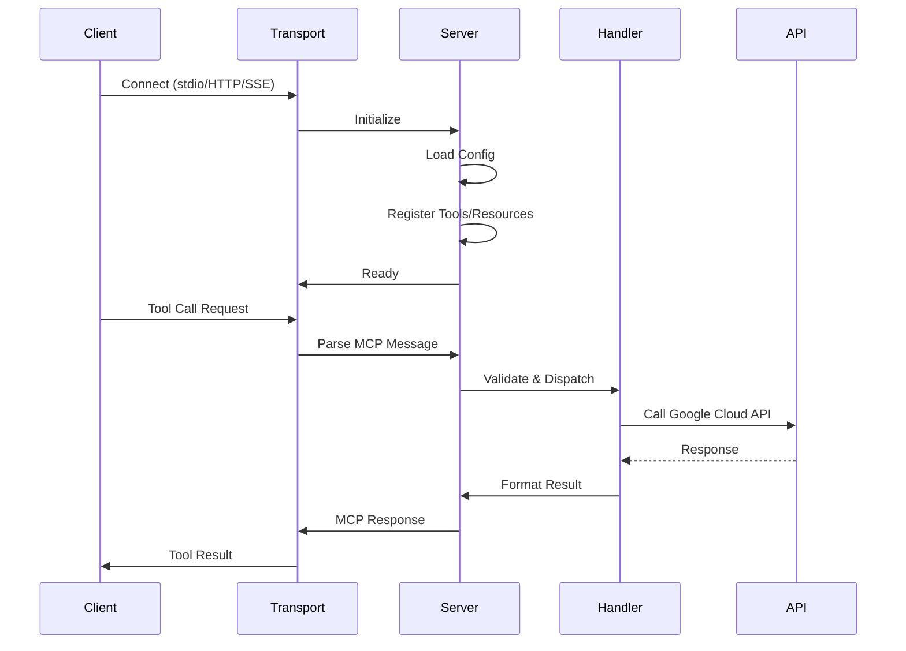

# Design Document: Rust MCP GenMedia

## Overview

This design describes a Rust 2024 edition implementation of MCP (Model Context Protocol) servers for generative media APIs. The system is organized as a Cargo workspace with seven crates: one shared library (`adk-rust-mcp-common`) and six executable MCP servers (`adk-rust-mcp-image`, `adk-rust-mcp-video`, `adk-rust-mcp-music`, `adk-rust-mcp-speech`, `adk-rust-mcp-multimodal`, `adk-rust-mcp-avtool`).

Each MCP server exposes tools and resources via the rmcp crate, supporting stdio, HTTP, and SSE transports. The architecture supports multiple providers through a trait-based abstraction, enabling cloud APIs (Google Vertex AI, OpenAI, Replicate) and local inference (mistral.rs, Ollama).

### Key Design Decisions

1. **Workspace Organization**: Each server is a separate binary crate for independent deployment and minimal binary size
2. **Shared Library**: Common functionality (config, storage, models, auth) lives in `adk-rust-mcp-common` to avoid duplication
3. **rmcp Crate**: Using the Rust MCP SDK for protocol compliance and transport abstraction
4. **Async-First**: All I/O operations use tokio async runtime for efficient concurrency
5. **Strong Typing**: Leverage Rust's type system with serde for JSON schema generation and validation
6. **Multi-Provider Architecture**: Provider traits enable swappable backends (cloud, local, hybrid)
7. **Feature Flags**: Optional providers compiled via Cargo features for minimal binary size

## Implementation Phases

The implementation follows a phased approach, with each phase building on the previous:

### Phase 1: Google Cloud Provider (Sprint 1-2)
- Core infrastructure and Google Vertex AI integration
- GCS storage backend
- All six MCP servers with Google Cloud backends
- Property-based testing framework

### Phase 2: Provider Abstraction (Sprint 3)
- Extract provider traits from Phase 1 implementations
- Refactor handlers to use trait objects
- Add provider configuration and selection
- Maintain backward compatibility

### Phase 3: OpenAI Provider (Sprint 4)
- OpenAI DALL-E 3 for image generation
- OpenAI TTS for speech synthesis
- S3-compatible storage backend option

### Phase 4: Local Inference (Sprint 5-6)
- mistral.rs integration for local diffusion models (FLUX)
- mistral.rs integration for local TTS (Dia)
- Ollama integration for compatible models
- Local file storage backend

### Phase 5: Additional Providers (Sprint 7+)
- Replicate API integration
- Stability AI integration
- ElevenLabs TTS integration
- Custom provider plugin system

## Architecture

```mermaid
graph TB
    subgraph "MCP Clients"
        C1[AI Assistant]
        C2[CLI Tool]
    end

    subgraph "Transport Layer"
        T1[stdio]
        T2[HTTP Streamable]
        T3[SSE]
    end

    subgraph "MCP Servers"
        S1[adk-rust-mcp-image]
        S2[adk-rust-mcp-video]
        S3[adk-rust-mcp-music]
        S4[adk-rust-mcp-speech]
        S5[adk-rust-mcp-multimodal]
        S6[adk-rust-mcp-avtool]
    end

    subgraph "adk-rust-mcp-common"
        CM[Config]
        ST[Storage Trait]
        PR[Provider Traits]
        AU[Auth]
        OT[OpenTelemetry]
    end

    subgraph "Storage Backends"
        GS[GCS Backend]
        S3[S3 Backend]
        FS[Local FS Backend]
    end

    subgraph "Image Providers"
        IP1[Google Imagen]
        IP2[OpenAI DALL-E]
        IP3[mistral.rs FLUX]
        IP4[Replicate]
    end

    subgraph "Video Providers"
        VP1[Google Veo]
        VP2[Replicate]
    end

    subgraph "Speech Providers"
        SP1[Google Cloud TTS]
        SP2[OpenAI TTS]
        SP3[mistral.rs Dia]
        SP4[ElevenLabs]
    end

    subgraph "Music Providers"
        MP1[Google Lyria]
    end

    subgraph "Local Tools"
        FF[FFmpeg/FFprobe]
    end

    C1 --> T1
    C1 --> T2
    C2 --> T1
    C2 --> T3

    T1 --> S1
    T1 --> S2
    T1 --> S3
    T1 --> S4
    T1 --> S5
    T1 --> S6
    T2 --> S1
    T3 --> S1

    S1 --> CM
    S1 --> ST
    S1 --> PR
    S1 --> AU
    S2 --> CM
    S2 --> ST
    S2 --> PR
    S2 --> AU
    S3 --> CM
    S3 --> ST
    S3 --> AU
    S4 --> CM
    S4 --> AU
    S5 --> CM
    S5 --> ST
    S5 --> AU
    S6 --> CM
    S6 --> ST

    ST --> GS
    ST --> S3
    ST --> FS

    PR --> IP1
    PR --> IP2
    PR --> IP3
    PR --> IP4
    PR --> VP1
    PR --> VP2
    PR --> SP1
    PR --> SP2
    PR --> SP3
    PR --> SP4
    PR --> MP1

    S6 --> FF
```



### Server Lifecycle



## Components and Interfaces

### adk-rust-mcp-common Crate

#### Config Module

```rust
/// Application configuration loaded from environment
pub struct Config {
    pub project_id: String,
    pub location: String,
    pub genmedia_bucket: Option<String>,
    pub port: u16,
}

impl Config {
    /// Load configuration from environment variables and .env file
    pub fn from_env() -> Result<Self, ConfigError>;
    
    /// Get the Vertex AI endpoint URL for a given API
    pub fn vertex_ai_endpoint(&self, api: &str) -> String;
}

/// Configuration errors
#[derive(Debug, thiserror::Error)]
pub enum ConfigError {
    #[error("Required environment variable {0} is not set")]
    MissingEnvVar(String),
    #[error("Invalid value for {0}: {1}")]
    InvalidValue(String, String),
}
```

#### GCS Module

```rust
/// GCS URI components
pub struct GcsUri {
    pub bucket: String,
    pub object: String,
}

impl GcsUri {
    /// Parse a gs:// URI into components
    pub fn parse(uri: &str) -> Result<Self, GcsError>;
    
    /// Format as gs:// URI string
    pub fn to_string(&self) -> String;
}

/// GCS operations client
pub struct GcsClient {
    client: reqwest::Client,
    auth: AuthProvider,
}

impl GcsClient {
    pub async fn new() -> Result<Self, GcsError>;
    
    /// Upload bytes to GCS
    pub async fn upload(&self, uri: &GcsUri, data: &[u8], content_type: &str) -> Result<(), GcsError>;
    
    /// Download bytes from GCS
    pub async fn download(&self, uri: &GcsUri) -> Result<Vec<u8>, GcsError>;
    
    /// Check if object exists
    pub async fn exists(&self, uri: &GcsUri) -> Result<bool, GcsError>;
}

#[derive(Debug, thiserror::Error)]
pub enum GcsError {
    #[error("Invalid GCS URI: {0}")]
    InvalidUri(String),
    #[error("GCS operation failed for {uri}: {message}")]
    OperationFailed { uri: String, message: String },
    #[error("Authentication error: {0}")]
    AuthError(String),
}
```

#### Storage Trait (Multi-Provider)

```rust
/// Abstract storage backend for media files
#[async_trait]
pub trait StorageBackend: Send + Sync {
    /// Upload bytes to storage
    async fn upload(&self, path: &str, data: &[u8], content_type: &str) -> Result<String, StorageError>;
    
    /// Download bytes from storage
    async fn download(&self, path: &str) -> Result<Vec<u8>, StorageError>;
    
    /// Check if object exists
    async fn exists(&self, path: &str) -> Result<bool, StorageError>;
    
    /// Get a public/signed URL for the object
    async fn get_url(&self, path: &str, expires_in: Duration) -> Result<String, StorageError>;
    
    /// Delete an object
    async fn delete(&self, path: &str) -> Result<(), StorageError>;
}

/// GCS storage backend implementation
pub struct GcsStorage {
    client: GcsClient,
    bucket: String,
}

impl StorageBackend for GcsStorage { /* ... */ }

/// S3-compatible storage backend (for OpenAI, Replicate, etc.)
#[cfg(feature = "s3")]
pub struct S3Storage {
    client: aws_sdk_s3::Client,
    bucket: String,
}

#[cfg(feature = "s3")]
impl StorageBackend for S3Storage { /* ... */ }

/// Local filesystem storage backend
pub struct LocalStorage {
    base_path: PathBuf,
}

impl StorageBackend for LocalStorage { /* ... */ }

#[derive(Debug, thiserror::Error)]
pub enum StorageError {
    #[error("Invalid path: {0}")]
    InvalidPath(String),
    #[error("Storage operation failed: {0}")]
    OperationFailed(String),
    #[error("Object not found: {0}")]
    NotFound(String),
    #[error("Authentication error: {0}")]
    AuthError(String),
}
```

#### Provider Traits (Multi-Provider)

```rust
/// Common output for generated images
#[derive(Debug, Clone)]
pub struct ImageOutput {
    pub data: Vec<u8>,
    pub mime_type: String,
    pub width: u32,
    pub height: u32,
}

/// Common output for generated video
#[derive(Debug, Clone)]
pub struct VideoOutput {
    pub data: Vec<u8>,
    pub mime_type: String,
    pub duration_seconds: f32,
    pub width: u32,
    pub height: u32,
}

/// Common output for generated audio
#[derive(Debug, Clone)]
pub struct AudioOutput {
    pub data: Vec<u8>,
    pub mime_type: String,
    pub duration_seconds: f32,
    pub sample_rate: u32,
}

/// Image generation provider trait
#[async_trait]
pub trait ImageProvider: Send + Sync {
    /// Provider name for logging/config
    fn name(&self) -> &str;
    
    /// List available models
    fn available_models(&self) -> Vec<ModelInfo>;
    
    /// Generate images from text prompt
    async fn generate(&self, params: ImageGenerateRequest) -> Result<Vec<ImageOutput>, ProviderError>;
    
    /// Check if provider supports a specific feature
    fn supports(&self, feature: ImageFeature) -> bool;
}

/// Image generation request (provider-agnostic)
#[derive(Debug, Clone)]
pub struct ImageGenerateRequest {
    pub prompt: String,
    pub negative_prompt: Option<String>,
    pub model: Option<String>,
    pub aspect_ratio: Option<String>,
    pub width: Option<u32>,
    pub height: Option<u32>,
    pub num_images: u8,
    pub seed: Option<i64>,
}

/// Image provider features
#[derive(Debug, Clone, Copy, PartialEq, Eq)]
pub enum ImageFeature {
    NegativePrompt,
    AspectRatio,
    CustomDimensions,
    Seed,
    Inpainting,
    Outpainting,
}

/// Video generation provider trait
#[async_trait]
pub trait VideoProvider: Send + Sync {
    fn name(&self) -> &str;
    fn available_models(&self) -> Vec<ModelInfo>;
    
    /// Generate video from text prompt
    async fn generate_from_text(&self, params: VideoTextRequest) -> Result<VideoOutput, ProviderError>;
    
    /// Generate video from image
    async fn generate_from_image(&self, params: VideoImageRequest) -> Result<VideoOutput, ProviderError>;
    
    fn supports(&self, feature: VideoFeature) -> bool;
}

#[derive(Debug, Clone)]
pub struct VideoTextRequest {
    pub prompt: String,
    pub model: Option<String>,
    pub aspect_ratio: Option<String>,
    pub duration_seconds: Option<u8>,
    pub generate_audio: bool,
}

#[derive(Debug, Clone)]
pub struct VideoImageRequest {
    pub image: Vec<u8>,
    pub prompt: String,
    pub model: Option<String>,
    pub aspect_ratio: Option<String>,
    pub duration_seconds: Option<u8>,
}

#[derive(Debug, Clone, Copy, PartialEq, Eq)]
pub enum VideoFeature {
    TextToVideo,
    ImageToVideo,
    AudioGeneration,
    CustomDuration,
}

/// Speech synthesis provider trait
#[async_trait]
pub trait SpeechProvider: Send + Sync {
    fn name(&self) -> &str;
    fn available_voices(&self) -> Vec<VoiceInfo>;
    
    /// Synthesize speech from text
    async fn synthesize(&self, params: SpeechRequest) -> Result<AudioOutput, ProviderError>;
    
    fn supports(&self, feature: SpeechFeature) -> bool;
}

#[derive(Debug, Clone)]
pub struct SpeechRequest {
    pub text: String,
    pub voice: Option<String>,
    pub language_code: Option<String>,
    pub speaking_rate: Option<f32>,
    pub pitch: Option<f32>,
    pub style: Option<String>,
}

#[derive(Debug, Clone)]
pub struct VoiceInfo {
    pub id: String,
    pub name: String,
    pub language_codes: Vec<String>,
    pub gender: Option<String>,
}

#[derive(Debug, Clone, Copy, PartialEq, Eq)]
pub enum SpeechFeature {
    SpeakingRate,
    Pitch,
    Style,
    SSML,
    CustomPronunciation,
}

/// Music generation provider trait
#[async_trait]
pub trait MusicProvider: Send + Sync {
    fn name(&self) -> &str;
    fn available_models(&self) -> Vec<ModelInfo>;
    
    /// Generate music from text prompt
    async fn generate(&self, params: MusicRequest) -> Result<Vec<AudioOutput>, ProviderError>;
    
    fn supports(&self, feature: MusicFeature) -> bool;
}

#[derive(Debug, Clone)]
pub struct MusicRequest {
    pub prompt: String,
    pub negative_prompt: Option<String>,
    pub duration_seconds: Option<u32>,
    pub num_samples: u8,
    pub seed: Option<i64>,
}

#[derive(Debug, Clone, Copy, PartialEq, Eq)]
pub enum MusicFeature {
    NegativePrompt,
    CustomDuration,
    Seed,
}

/// Model information
#[derive(Debug, Clone)]
pub struct ModelInfo {
    pub id: String,
    pub name: String,
    pub description: Option<String>,
    pub max_prompt_length: Option<usize>,
}

/// Provider errors
#[derive(Debug, thiserror::Error)]
pub enum ProviderError {
    #[error("Provider not configured: {0}")]
    NotConfigured(String),
    #[error("Model not found: {0}")]
    ModelNotFound(String),
    #[error("Feature not supported: {0}")]
    FeatureNotSupported(String),
    #[error("API error: {0}")]
    ApiError(String),
    #[error("Rate limited: retry after {0} seconds")]
    RateLimited(u32),
    #[error("Invalid input: {0}")]
    InvalidInput(String),
    #[error("Generation failed: {0}")]
    GenerationFailed(String),
}
```

#### Provider Registry

```rust
/// Registry for managing multiple providers
pub struct ProviderRegistry {
    image_providers: HashMap<String, Arc<dyn ImageProvider>>,
    video_providers: HashMap<String, Arc<dyn VideoProvider>>,
    speech_providers: HashMap<String, Arc<dyn SpeechProvider>>,
    music_providers: HashMap<String, Arc<dyn MusicProvider>>,
    default_image: Option<String>,
    default_video: Option<String>,
    default_speech: Option<String>,
    default_music: Option<String>,
}

impl ProviderRegistry {
    pub fn new() -> Self;
    
    /// Register an image provider
    pub fn register_image(&mut self, name: &str, provider: Arc<dyn ImageProvider>);
    
    /// Get image provider by name or default
    pub fn get_image(&self, name: Option<&str>) -> Option<Arc<dyn ImageProvider>>;
    
    /// Set default image provider
    pub fn set_default_image(&mut self, name: &str);
    
    /// List all registered image providers
    pub fn list_image_providers(&self) -> Vec<&str>;
    
    // Similar methods for video, speech, music...
}

/// Provider configuration from environment/config file
#[derive(Debug, Clone, Deserialize)]
pub struct ProviderConfig {
    /// Default provider for each media type
    pub defaults: ProviderDefaults,
    /// Google Cloud provider settings
    #[serde(default)]
    pub google: Option<GoogleProviderConfig>,
    /// OpenAI provider settings
    #[serde(default)]
    pub openai: Option<OpenAIProviderConfig>,
    /// Local inference settings
    #[serde(default)]
    pub local: Option<LocalProviderConfig>,
    /// Replicate provider settings
    #[serde(default)]
    pub replicate: Option<ReplicateProviderConfig>,
}

#[derive(Debug, Clone, Deserialize)]
pub struct ProviderDefaults {
    pub image: String,
    pub video: String,
    pub speech: String,
    pub music: String,
}

#[derive(Debug, Clone, Deserialize)]
pub struct GoogleProviderConfig {
    pub project_id: String,
    pub location: String,
    pub bucket: Option<String>,
}

#[derive(Debug, Clone, Deserialize)]
pub struct OpenAIProviderConfig {
    pub api_key: String,
    pub organization_id: Option<String>,
}

#[derive(Debug, Clone, Deserialize)]
pub struct LocalProviderConfig {
    /// Path to model cache directory
    pub model_cache: PathBuf,
    /// Device to use (cpu, cuda:0, metal)
    pub device: String,
    /// Models to preload
    pub preload_models: Vec<String>,
}

#[derive(Debug, Clone, Deserialize)]
pub struct ReplicateProviderConfig {
    pub api_token: String,
}
```

#### Models Module

```rust
/// Imagen model definitions
#[derive(Debug, Clone, Serialize, Deserialize)]
pub struct ImagenModel {
    pub id: &'static str,
    pub aliases: &'static [&'static str],
    pub max_prompt_length: usize,
    pub supported_aspect_ratios: &'static [&'static str],
    pub max_images: u8,
}

/// Veo model definitions
#[derive(Debug, Clone, Serialize, Deserialize)]
pub struct VeoModel {
    pub id: &'static str,
    pub aliases: &'static [&'static str],
    pub supported_aspect_ratios: &'static [&'static str],
    pub duration_range: (u8, u8),
    pub supports_audio: bool,
}

/// Model registry for resolution
pub struct ModelRegistry;

impl ModelRegistry {
    /// Resolve an Imagen model name or alias to full model ID
    pub fn resolve_imagen(name: &str) -> Option<&'static ImagenModel>;
    
    /// Resolve a Veo model name or alias to full model ID
    pub fn resolve_veo(name: &str) -> Option<&'static VeoModel>;
    
    /// List all available Imagen models
    pub fn list_imagen_models() -> &'static [ImagenModel];
    
    /// List all available Veo models
    pub fn list_veo_models() -> &'static [VeoModel];
}
```

#### Auth Module

```rust
/// Authentication provider using ADC
pub struct AuthProvider {
    // Internal token cache and refresh logic
}

impl AuthProvider {
    /// Create a new auth provider using Application Default Credentials
    pub async fn new() -> Result<Self, AuthError>;
    
    /// Get a valid access token, refreshing if necessary
    pub async fn get_token(&self, scopes: &[&str]) -> Result<String, AuthError>;
}

#[derive(Debug, thiserror::Error)]
pub enum AuthError {
    #[error("ADC not configured. Run 'gcloud auth application-default login' or set GOOGLE_APPLICATION_CREDENTIALS")]
    NotConfigured,
    #[error("Token refresh failed: {0}")]
    RefreshFailed(String),
}
```

### MCP Server Trait Pattern

Each server implements a common pattern using rmcp:

```rust
use rmcp::{Server, Tool, Resource, handler};

/// Common server builder pattern
pub struct McpServerBuilder<H> {
    handler: H,
    transport: Transport,
}

impl<H: McpHandler> McpServerBuilder<H> {
    pub fn new(handler: H) -> Self;
    pub fn with_transport(self, transport: Transport) -> Self;
    pub async fn run(self) -> Result<(), ServerError>;
}

/// Transport configuration
pub enum Transport {
    Stdio,
    Http { port: u16 },
    Sse { port: u16 },
}
```

### Provider Implementations

#### Google Cloud Providers (Phase 1)

```rust
/// Google Imagen image provider
#[cfg(feature = "google")]
pub struct GoogleImagenProvider {
    config: GoogleProviderConfig,
    http: reqwest::Client,
    auth: AuthProvider,
}

#[cfg(feature = "google")]
#[async_trait]
impl ImageProvider for GoogleImagenProvider {
    fn name(&self) -> &str { "google-imagen" }
    
    fn available_models(&self) -> Vec<ModelInfo> {
        vec![
            ModelInfo { id: "imagen-4.0-generate-preview-05-20".into(), name: "Imagen 4".into(), .. },
            ModelInfo { id: "imagen-3.0-generate-002".into(), name: "Imagen 3".into(), .. },
        ]
    }
    
    async fn generate(&self, params: ImageGenerateRequest) -> Result<Vec<ImageOutput>, ProviderError> {
        // Build Vertex AI Imagen API request
        // Handle response parsing and base64 image extraction
    }
    
    fn supports(&self, feature: ImageFeature) -> bool {
        matches!(feature, ImageFeature::NegativePrompt | ImageFeature::AspectRatio | ImageFeature::Seed)
    }
}

/// Google Veo video provider
#[cfg(feature = "google")]
pub struct GoogleVeoProvider {
    config: GoogleProviderConfig,
    http: reqwest::Client,
    auth: AuthProvider,
    storage: Arc<dyn StorageBackend>,
}

#[cfg(feature = "google")]
#[async_trait]
impl VideoProvider for GoogleVeoProvider {
    fn name(&self) -> &str { "google-veo" }
    
    async fn generate_from_text(&self, params: VideoTextRequest) -> Result<VideoOutput, ProviderError> {
        // Build Vertex AI Veo API request
        // Poll LRO until completion
        // Download from GCS output
    }
    
    fn supports(&self, feature: VideoFeature) -> bool {
        matches!(feature, VideoFeature::TextToVideo | VideoFeature::ImageToVideo | VideoFeature::AudioGeneration)
    }
}

/// Google Cloud TTS speech provider
#[cfg(feature = "google")]
pub struct GoogleTtsProvider {
    config: GoogleProviderConfig,
    http: reqwest::Client,
    auth: AuthProvider,
}

#[cfg(feature = "google")]
#[async_trait]
impl SpeechProvider for GoogleTtsProvider {
    fn name(&self) -> &str { "google-tts" }
    
    fn available_voices(&self) -> Vec<VoiceInfo> {
        // Return Chirp3-HD voices
    }
    
    async fn synthesize(&self, params: SpeechRequest) -> Result<AudioOutput, ProviderError> {
        // Build Cloud TTS API request
    }
    
    fn supports(&self, feature: SpeechFeature) -> bool {
        matches!(feature, SpeechFeature::SpeakingRate | SpeechFeature::Pitch | SpeechFeature::SSML | SpeechFeature::CustomPronunciation)
    }
}

/// Google Lyria music provider
#[cfg(feature = "google")]
pub struct GoogleLyriaProvider {
    config: GoogleProviderConfig,
    http: reqwest::Client,
    auth: AuthProvider,
}

#[cfg(feature = "google")]
#[async_trait]
impl MusicProvider for GoogleLyriaProvider {
    fn name(&self) -> &str { "google-lyria" }
    
    async fn generate(&self, params: MusicRequest) -> Result<Vec<AudioOutput>, ProviderError> {
        // Build Vertex AI Lyria API request
    }
}
```

#### OpenAI Providers (Phase 3)

```rust
/// OpenAI DALL-E image provider
#[cfg(feature = "openai")]
pub struct OpenAIDalleProvider {
    config: OpenAIProviderConfig,
    http: reqwest::Client,
}

#[cfg(feature = "openai")]
#[async_trait]
impl ImageProvider for OpenAIDalleProvider {
    fn name(&self) -> &str { "openai-dalle" }
    
    fn available_models(&self) -> Vec<ModelInfo> {
        vec![
            ModelInfo { id: "dall-e-3".into(), name: "DALL-E 3".into(), .. },
            ModelInfo { id: "dall-e-2".into(), name: "DALL-E 2".into(), .. },
        ]
    }
    
    async fn generate(&self, params: ImageGenerateRequest) -> Result<Vec<ImageOutput>, ProviderError> {
        // Build OpenAI images/generations API request
    }
    
    fn supports(&self, feature: ImageFeature) -> bool {
        matches!(feature, ImageFeature::CustomDimensions)
    }
}

/// OpenAI TTS speech provider
#[cfg(feature = "openai")]
pub struct OpenAITtsProvider {
    config: OpenAIProviderConfig,
    http: reqwest::Client,
}

#[cfg(feature = "openai")]
#[async_trait]
impl SpeechProvider for OpenAITtsProvider {
    fn name(&self) -> &str { "openai-tts" }
    
    fn available_voices(&self) -> Vec<VoiceInfo> {
        vec![
            VoiceInfo { id: "alloy".into(), name: "Alloy".into(), .. },
            VoiceInfo { id: "echo".into(), name: "Echo".into(), .. },
            VoiceInfo { id: "fable".into(), name: "Fable".into(), .. },
            VoiceInfo { id: "onyx".into(), name: "Onyx".into(), .. },
            VoiceInfo { id: "nova".into(), name: "Nova".into(), .. },
            VoiceInfo { id: "shimmer".into(), name: "Shimmer".into(), .. },
        ]
    }
    
    async fn synthesize(&self, params: SpeechRequest) -> Result<AudioOutput, ProviderError> {
        // Build OpenAI audio/speech API request
    }
    
    fn supports(&self, feature: SpeechFeature) -> bool {
        matches!(feature, SpeechFeature::SpeakingRate)
    }
}
```

#### Local Inference Providers (Phase 4)

```rust
/// mistral.rs FLUX diffusion image provider
#[cfg(feature = "local")]
pub struct MistralRsFluxProvider {
    config: LocalProviderConfig,
    model: Arc<MistralRsDiffusionModel>,
}

#[cfg(feature = "local")]
impl MistralRsFluxProvider {
    pub async fn new(config: LocalProviderConfig) -> Result<Self, ProviderError> {
        let diffusion_config = DiffusionConfig::builder()
            .model_source(ModelSource::huggingface("black-forest-labs/FLUX.1-schnell"))
            .model_type(DiffusionModelType::FluxOffloaded)
            .device(Device::from_str(&config.device)?)
            .build();
        
        let model = MistralRsDiffusionModel::new(diffusion_config).await?;
        Ok(Self { config, model: Arc::new(model) })
    }
}

#[cfg(feature = "local")]
#[async_trait]
impl ImageProvider for MistralRsFluxProvider {
    fn name(&self) -> &str { "local-flux" }
    
    fn available_models(&self) -> Vec<ModelInfo> {
        vec![
            ModelInfo { id: "flux-schnell".into(), name: "FLUX.1 Schnell".into(), .. },
            ModelInfo { id: "flux-dev".into(), name: "FLUX.1 Dev".into(), .. },
        ]
    }
    
    async fn generate(&self, params: ImageGenerateRequest) -> Result<Vec<ImageOutput>, ProviderError> {
        let diffusion_params = DiffusionParams::new()
            .with_size(params.width.unwrap_or(1024), params.height.unwrap_or(1024));
        
        let output = self.model.generate_image(&params.prompt, diffusion_params).await?;
        
        Ok(vec![ImageOutput {
            data: output.to_bytes()?,
            mime_type: "image/png".into(),
            width: output.width,
            height: output.height,
        }])
    }
    
    fn supports(&self, feature: ImageFeature) -> bool {
        matches!(feature, ImageFeature::CustomDimensions | ImageFeature::Seed)
    }
}

/// mistral.rs Dia speech provider
#[cfg(feature = "local")]
pub struct MistralRsDiaProvider {
    config: LocalProviderConfig,
    model: Arc<MistralRsSpeechModel>,
}

#[cfg(feature = "local")]
impl MistralRsDiaProvider {
    pub async fn new(config: LocalProviderConfig) -> Result<Self, ProviderError> {
        let speech_config = SpeechConfig::builder()
            .model_source(ModelSource::huggingface("nari-labs/Dia-1.6B"))
            .device(Device::from_str(&config.device)?)
            .build();
        
        let model = MistralRsSpeechModel::new(speech_config).await?;
        Ok(Self { config, model: Arc::new(model) })
    }
}

#[cfg(feature = "local")]
#[async_trait]
impl SpeechProvider for MistralRsDiaProvider {
    fn name(&self) -> &str { "local-dia" }
    
    fn available_voices(&self) -> Vec<VoiceInfo> {
        vec![
            VoiceInfo { id: "S1".into(), name: "Speaker 1".into(), .. },
            VoiceInfo { id: "S2".into(), name: "Speaker 2".into(), .. },
        ]
    }
    
    async fn synthesize(&self, params: SpeechRequest) -> Result<AudioOutput, ProviderError> {
        let voice_config = VoiceConfig::new()
            .with_speaker_id(params.voice.as_deref().unwrap_or("S1").parse().unwrap_or(1));
        
        let output = self.model.generate_speech_with_config(&params.text, voice_config).await?;
        
        Ok(AudioOutput {
            data: output.to_wav_bytes()?,
            mime_type: "audio/wav".into(),
            duration_seconds: output.duration_seconds(),
            sample_rate: output.sample_rate,
        })
    }
    
    fn supports(&self, feature: SpeechFeature) -> bool {
        matches!(feature, SpeechFeature::SpeakingRate)
    }
}

/// Ollama-based providers (for compatible models)
#[cfg(feature = "ollama")]
pub struct OllamaImageProvider {
    config: OllamaConfig,
    client: Ollama,
}

#[cfg(feature = "ollama")]
#[async_trait]
impl ImageProvider for OllamaImageProvider {
    fn name(&self) -> &str { "ollama" }
    
    fn available_models(&self) -> Vec<ModelInfo> {
        // Query Ollama for available vision/generation models
    }
    
    async fn generate(&self, params: ImageGenerateRequest) -> Result<Vec<ImageOutput>, ProviderError> {
        // Use Ollama's image generation capabilities if available
    }
}
```

#### Replicate Provider (Phase 5)

```rust
/// Replicate API provider for various models
#[cfg(feature = "replicate")]
pub struct ReplicateImageProvider {
    config: ReplicateProviderConfig,
    http: reqwest::Client,
}

#[cfg(feature = "replicate")]
#[async_trait]
impl ImageProvider for ReplicateImageProvider {
    fn name(&self) -> &str { "replicate" }
    
    fn available_models(&self) -> Vec<ModelInfo> {
        vec![
            ModelInfo { id: "stability-ai/sdxl".into(), name: "Stable Diffusion XL".into(), .. },
            ModelInfo { id: "black-forest-labs/flux-schnell".into(), name: "FLUX Schnell".into(), .. },
        ]
    }
    
    async fn generate(&self, params: ImageGenerateRequest) -> Result<Vec<ImageOutput>, ProviderError> {
        // Build Replicate predictions API request
        // Poll for completion
        // Download output
    }
}

#[cfg(feature = "replicate")]
pub struct ReplicateVideoProvider {
    config: ReplicateProviderConfig,
    http: reqwest::Client,
}

#[cfg(feature = "replicate")]
#[async_trait]
impl VideoProvider for ReplicateVideoProvider {
    fn name(&self) -> &str { "replicate" }
    
    async fn generate_from_text(&self, params: VideoTextRequest) -> Result<VideoOutput, ProviderError> {
        // Use Replicate video models
    }
}
```

### adk-rust-mcp-image Server

```rust
/// Image generation tool handler (multi-provider)
pub struct ImageHandler {
    config: Config,
    providers: ProviderRegistry,
    storage: Arc<dyn StorageBackend>,
}

/// Text-to-image generation parameters
#[derive(Debug, Deserialize, JsonSchema)]
pub struct ImageGenerateParams {
    /// Text prompt describing the image to generate
    pub prompt: String,
    /// Negative prompt - what to avoid
    #[serde(default)]
    pub negative_prompt: Option<String>,
    /// Provider to use (default: from config)
    #[serde(default)]
    pub provider: Option<String>,
    /// Model to use (provider-specific)
    #[serde(default)]
    pub model: Option<String>,
    /// Aspect ratio (1:1, 3:4, 4:3, 9:16, 16:9)
    #[serde(default)]
    pub aspect_ratio: Option<String>,
    /// Image width (for providers that support custom dimensions)
    #[serde(default)]
    pub width: Option<u32>,
    /// Image height (for providers that support custom dimensions)
    #[serde(default)]
    pub height: Option<u32>,
    /// Number of images to generate (1-4)
    #[serde(default = "default_one")]
    pub number_of_images: u8,
    /// Random seed for reproducibility
    #[serde(default)]
    pub seed: Option<i64>,
    /// Output file path (optional)
    pub output_file: Option<String>,
    /// Output storage URI (optional, e.g., gs://, s3://)
    pub output_uri: Option<String>,
}

impl ImageHandler {
    pub async fn new(config: Config, providers: ProviderRegistry, storage: Arc<dyn StorageBackend>) -> Result<Self, Error>;
    
    /// Generate images from text prompt
    pub async fn generate_image(&self, params: ImageGenerateParams) -> Result<ToolResult, Error> {
        // Get provider (from params or default)
        let provider = self.providers.get_image(params.provider.as_deref())
            .ok_or_else(|| Error::Validation("No image provider configured".into()))?;
        
        // Build provider-agnostic request
        let request = ImageGenerateRequest {
            prompt: params.prompt,
            negative_prompt: params.negative_prompt,
            model: params.model,
            aspect_ratio: params.aspect_ratio,
            width: params.width,
            height: params.height,
            num_images: params.number_of_images,
            seed: params.seed,
        };
        
        // Generate via provider
        let outputs = provider.generate(request).await?;
        
        // Handle output (return base64, save to file, or upload to storage)
        self.handle_outputs(outputs, &params).await
    }
    
    /// List available providers resource
    pub async fn list_providers(&self) -> Result<ResourceContent, Error>;
    
    /// List available models resource (aggregated from all providers)
    pub async fn list_models(&self) -> Result<ResourceContent, Error>;
}
```
```

### adk-rust-mcp-video Server

```rust
/// Video generation tool handler
pub struct VideoHandler {
    config: Config,
    gcs: GcsClient,
    http: reqwest::Client,
    auth: AuthProvider,
}

/// Text-to-video generation parameters
#[derive(Debug, Deserialize, JsonSchema)]
pub struct VideoGenerateParams {
    pub prompt: String,
    #[serde(default = "default_veo_model")]
    pub model: String,
    #[serde(default = "default_16_9")]
    pub aspect_ratio: String,
    #[serde(default)]
    pub duration_seconds: Option<u8>,
    pub output_gcs_uri: String,
    #[serde(default)]
    pub download_local: bool,
    #[serde(default)]
    pub generate_audio: Option<bool>,
}

/// Image-to-video generation parameters
#[derive(Debug, Deserialize, JsonSchema)]
pub struct VideoFromImageParams {
    /// Input image (base64, local path, or GCS URI)
    pub image: String,
    pub prompt: String,
    #[serde(default = "default_veo_model")]
    pub model: String,
    #[serde(default = "default_16_9")]
    pub aspect_ratio: String,
    #[serde(default)]
    pub duration_seconds: Option<u8>,
    pub output_gcs_uri: String,
    #[serde(default)]
    pub download_local: bool,
}

/// Long-running operation response
#[derive(Debug, Deserialize)]
struct LroResponse {
    name: String,
    done: bool,
    error: Option<LroError>,
    response: Option<VeoResponse>,
}

impl VideoHandler {
    pub async fn new(config: Config) -> Result<Self, Error>;
    
    /// Generate video from text
    pub async fn generate_video(&self, params: VideoGenerateParams) -> Result<ToolResult, Error>;
    
    /// Generate video from image
    pub async fn video_from_image(&self, params: VideoFromImageParams) -> Result<ToolResult, Error>;
    
    /// Poll LRO until completion
    async fn poll_operation(&self, operation_name: &str) -> Result<VeoResponse, Error>;
}
```

### adk-rust-mcp-music Server

```rust
/// Music generation tool handler
pub struct MusicHandler {
    config: Config,
    gcs: GcsClient,
    http: reqwest::Client,
    auth: AuthProvider,
}

/// Music generation parameters
#[derive(Debug, Deserialize, JsonSchema)]
pub struct MusicGenerateParams {
    pub prompt: String,
    #[serde(default)]
    pub negative_prompt: Option<String>,
    #[serde(default)]
    pub seed: Option<i64>,
    #[serde(default = "default_one")]
    pub sample_count: u8,
    pub output_file: Option<String>,
    pub output_gcs_uri: Option<String>,
}

impl MusicHandler {
    pub async fn new(config: Config) -> Result<Self, Error>;
    
    /// Generate music from text prompt
    pub async fn generate_music(&self, params: MusicGenerateParams) -> Result<ToolResult, Error>;
}
```

### adk-rust-mcp-speech Server

```rust
/// Speech synthesis tool handler
pub struct SpeechHandler {
    config: Config,
    http: reqwest::Client,
    auth: AuthProvider,
}

/// TTS parameters
#[derive(Debug, Deserialize, JsonSchema)]
pub struct SpeechSynthesizeParams {
    pub text: String,
    #[serde(default)]
    pub voice: Option<String>,
    #[serde(default = "default_en_us")]
    pub language_code: String,
    #[serde(default = "default_one_f32")]
    pub speaking_rate: f32,
    #[serde(default)]
    pub pitch: f32,
    #[serde(default)]
    pub pronunciations: Option<Vec<Pronunciation>>,
    pub output_file: Option<String>,
}

/// Custom pronunciation
#[derive(Debug, Deserialize, JsonSchema)]
pub struct Pronunciation {
    pub word: String,
    pub phonetic: String,
    /// "ipa" or "x-sampa"
    pub alphabet: String,
}

impl SpeechHandler {
    pub async fn new(config: Config) -> Result<Self, Error>;
    
    /// Convert text to speech
    pub async fn synthesize(&self, params: SpeechSynthesizeParams) -> Result<ToolResult, Error>;
    
    /// List available voices
    pub async fn list_voices(&self) -> Result<ToolResult, Error>;
}
```

### adk-rust-mcp-multimodal Server

```rust
/// Multimodal generation handler (Gemini)
pub struct MultimodalHandler {
    config: Config,
    gcs: GcsClient,
    http: reqwest::Client,
    auth: AuthProvider,
}

/// Image generation parameters
#[derive(Debug, Deserialize, JsonSchema)]
pub struct MultimodalImageParams {
    pub prompt: String,
    #[serde(default)]
    pub model: Option<String>,
    pub output_file: Option<String>,
}

/// TTS parameters
#[derive(Debug, Deserialize, JsonSchema)]
pub struct MultimodalSpeechParams {
    pub text: String,
    #[serde(default)]
    pub voice: Option<String>,
    #[serde(default)]
    pub style: Option<String>,
    pub output_file: Option<String>,
}

impl MultimodalHandler {
    pub async fn new(config: Config) -> Result<Self, Error>;
    
    /// Generate image using Gemini
    pub async fn generate_image(&self, params: MultimodalImageParams) -> Result<ToolResult, Error>;
    
    /// Generate speech using Gemini
    pub async fn synthesize_speech(&self, params: MultimodalSpeechParams) -> Result<ToolResult, Error>;
    
    /// List available voices
    pub async fn list_voices(&self) -> Result<ToolResult, Error>;
    
    /// List language codes resource
    pub async fn list_language_codes(&self) -> Result<ResourceContent, Error>;
}
```

### adk-rust-mcp-avtool Server

```rust
/// AVTool FFmpeg handler
pub struct AVToolHandler {
    config: Config,
    gcs: GcsClient,
}

/// Media info result
#[derive(Debug, Serialize)]
pub struct MediaInfo {
    pub duration: f64,
    pub format: String,
    pub streams: Vec<StreamInfo>,
}

#[derive(Debug, Serialize)]
pub struct StreamInfo {
    pub index: u32,
    pub codec_type: String,
    pub codec_name: String,
    pub width: Option<u32>,
    pub height: Option<u32>,
    pub sample_rate: Option<u32>,
    pub channels: Option<u32>,
}

/// Audio conversion parameters
#[derive(Debug, Deserialize, JsonSchema)]
pub struct ConvertAudioParams {
    pub input: String,
    pub output: String,
    #[serde(default = "default_bitrate")]
    pub bitrate: String,
}

/// Video to GIF parameters
#[derive(Debug, Deserialize, JsonSchema)]
pub struct VideoToGifParams {
    pub input: String,
    pub output: String,
    #[serde(default = "default_fps")]
    pub fps: u8,
    #[serde(default)]
    pub width: Option<u32>,
    #[serde(default)]
    pub start_time: Option<f64>,
    #[serde(default)]
    pub duration: Option<f64>,
}

/// Combine audio and video parameters
#[derive(Debug, Deserialize, JsonSchema)]
pub struct CombineAvParams {
    pub video_input: String,
    pub audio_input: String,
    pub output: String,
}

/// Overlay image parameters
#[derive(Debug, Deserialize, JsonSchema)]
pub struct OverlayImageParams {
    pub video_input: String,
    pub image_input: String,
    pub output: String,
    #[serde(default)]
    pub x: i32,
    #[serde(default)]
    pub y: i32,
    #[serde(default)]
    pub scale: Option<f32>,
    #[serde(default)]
    pub start_time: Option<f64>,
    #[serde(default)]
    pub duration: Option<f64>,
}

/// Concatenate files parameters
#[derive(Debug, Deserialize, JsonSchema)]
pub struct ConcatenateParams {
    pub inputs: Vec<String>,
    pub output: String,
}

/// Volume adjustment parameters
#[derive(Debug, Deserialize, JsonSchema)]
pub struct AdjustVolumeParams {
    pub input: String,
    pub output: String,
    /// Volume multiplier (e.g., 0.5, 2.0) or dB string (e.g., "-3dB", "+6dB")
    pub volume: String,
}

/// Layer audio parameters
#[derive(Debug, Deserialize, JsonSchema)]
pub struct LayerAudioParams {
    pub inputs: Vec<AudioLayer>,
    pub output: String,
}

#[derive(Debug, Deserialize, JsonSchema)]
pub struct AudioLayer {
    pub path: String,
    #[serde(default)]
    pub offset_seconds: f64,
    #[serde(default = "default_one_f32")]
    pub volume: f32,
}

impl AVToolHandler {
    pub async fn new(config: Config) -> Result<Self, Error>;
    
    /// Get media file information
    pub async fn get_media_info(&self, input: &str) -> Result<MediaInfo, Error>;
    
    /// Convert WAV to MP3
    pub async fn convert_wav_to_mp3(&self, params: ConvertAudioParams) -> Result<ToolResult, Error>;
    
    /// Convert video to GIF
    pub async fn video_to_gif(&self, params: VideoToGifParams) -> Result<ToolResult, Error>;
    
    /// Combine audio and video
    pub async fn combine_audio_video(&self, params: CombineAvParams) -> Result<ToolResult, Error>;
    
    /// Overlay image on video
    pub async fn overlay_image(&self, params: OverlayImageParams) -> Result<ToolResult, Error>;
    
    /// Concatenate media files
    pub async fn concatenate(&self, params: ConcatenateParams) -> Result<ToolResult, Error>;
    
    /// Adjust audio volume
    pub async fn adjust_volume(&self, params: AdjustVolumeParams) -> Result<ToolResult, Error>;
    
    /// Layer multiple audio files
    pub async fn layer_audio(&self, params: LayerAudioParams) -> Result<ToolResult, Error>;
    
    /// Resolve input path (download from GCS if needed)
    async fn resolve_input(&self, path: &str) -> Result<PathBuf, Error>;
    
    /// Handle output (upload to GCS if needed)
    async fn handle_output(&self, local_path: &Path, output: &str) -> Result<String, Error>;
}
```

## Data Models

### MCP Protocol Types

```rust
/// MCP tool result content types
pub enum ToolContent {
    Text { text: String },
    Image { data: String, mime_type: String },
    Resource { uri: String, mime_type: String },
}

/// MCP tool result
pub struct ToolResult {
    pub content: Vec<ToolContent>,
    pub is_error: bool,
}

/// MCP resource content
pub struct ResourceContent {
    pub uri: String,
    pub mime_type: String,
    pub text: Option<String>,
    pub blob: Option<String>,
}
```

### API Request/Response Types

```rust
/// Vertex AI Imagen request
#[derive(Debug, Serialize)]
pub struct ImagenRequest {
    pub instances: Vec<ImagenInstance>,
    pub parameters: ImagenParameters,
}

#[derive(Debug, Serialize)]
pub struct ImagenInstance {
    pub prompt: String,
    #[serde(skip_serializing_if = "Option::is_none")]
    pub negative_prompt: Option<String>,
}

#[derive(Debug, Serialize)]
#[serde(rename_all = "camelCase")]
pub struct ImagenParameters {
    pub sample_count: u8,
    pub aspect_ratio: String,
    #[serde(skip_serializing_if = "Option::is_none")]
    pub output_options: Option<OutputOptions>,
}

/// Vertex AI Veo request
#[derive(Debug, Serialize)]
pub struct VeoRequest {
    pub instances: Vec<VeoInstance>,
    pub parameters: VeoParameters,
}

#[derive(Debug, Serialize)]
pub struct VeoInstance {
    pub prompt: String,
    #[serde(skip_serializing_if = "Option::is_none")]
    pub image: Option<VeoImage>,
}

#[derive(Debug, Serialize)]
pub struct VeoImage {
    #[serde(rename = "bytesBase64Encoded")]
    pub bytes_base64_encoded: String,
}

#[derive(Debug, Serialize)]
#[serde(rename_all = "camelCase")]
pub struct VeoParameters {
    pub aspect_ratio: String,
    #[serde(skip_serializing_if = "Option::is_none")]
    pub duration_seconds: Option<u8>,
    pub output_gcs_uri: String,
    #[serde(skip_serializing_if = "Option::is_none")]
    pub generate_audio: Option<bool>,
}

/// Cloud TTS request
#[derive(Debug, Serialize)]
pub struct TtsRequest {
    pub input: TtsInput,
    pub voice: TtsVoice,
    pub audio_config: TtsAudioConfig,
}

#[derive(Debug, Serialize)]
pub struct TtsInput {
    pub text: String,
}

#[derive(Debug, Serialize)]
#[serde(rename_all = "camelCase")]
pub struct TtsVoice {
    pub language_code: String,
    pub name: String,
}

#[derive(Debug, Serialize)]
#[serde(rename_all = "camelCase")]
pub struct TtsAudioConfig {
    pub audio_encoding: String,
    #[serde(skip_serializing_if = "Option::is_none")]
    pub speaking_rate: Option<f32>,
    #[serde(skip_serializing_if = "Option::is_none")]
    pub pitch: Option<f32>,
}
```

### Error Types

```rust
/// Unified error type for all servers
#[derive(Debug, thiserror::Error)]
pub enum Error {
    #[error("Configuration error: {0}")]
    Config(#[from] ConfigError),
    
    #[error("GCS error: {0}")]
    Gcs(#[from] GcsError),
    
    #[error("Authentication error: {0}")]
    Auth(#[from] AuthError),
    
    #[error("API error: {endpoint} returned {status}: {message}")]
    Api {
        endpoint: String,
        status: u16,
        message: String,
    },
    
    #[error("Validation error: {0}")]
    Validation(String),
    
    #[error("IO error: {0}")]
    Io(#[from] std::io::Error),
    
    #[error("FFmpeg error: {0}")]
    Ffmpeg(String),
    
    #[error("Timeout waiting for operation: {0}")]
    Timeout(String),
}
```


## Correctness Properties

*A property is a characteristic or behavior that should hold true across all valid executions of a system—essentially, a formal statement about what the system should do. Properties serve as the bridge between human-readable specifications and machine-verifiable correctness guarantees.*

### Property 1: Configuration Loading with Defaults

*For any* environment configuration where PROJECT_ID is set, loading the config SHALL succeed and return the correct PROJECT_ID. *For any* optional variable (LOCATION, GENMEDIA_BUCKET, PORT) that is not set, the config SHALL use the defined default value.

**Validates: Requirements 2.1, 2.3, 2.4, 2.5**

### Property 2: GCS URI Round-Trip Parsing

*For any* valid GCS URI in the format `gs://bucket/path/to/object`, parsing the URI into a `GcsUri` struct and then formatting it back to a string SHALL produce an equivalent URI string.

**Validates: Requirements 2.9**

### Property 3: GCS Upload/Download Round-Trip

*For any* byte array and valid GCS URI, uploading the bytes to GCS and then downloading from the same URI SHALL return the original byte array (assuming no concurrent modifications).

**Validates: Requirements 2.7, 2.8**

### Property 4: Model Alias Resolution Consistency

*For any* model alias defined in the Models_Module, resolving the alias SHALL return a valid model definition. *For any* model's canonical ID, resolving it SHALL return the same model definition as resolving any of its aliases.

**Validates: Requirements 2.14**

### Property 5: Tool Schema Validity

*For any* registered MCP tool, its parameter schema SHALL be valid JSON Schema. *For any* registered MCP resource, its URI template SHALL be a valid URI template according to RFC 6570.

**Validates: Requirements 3.7, 3.8**

### Property 6: Input Parameter Validation

*For any* tool invocation with parameters that do not match the tool's JSON schema, the MCP_Server SHALL reject the request with a validation error. *For any* tool invocation with parameters that match the schema, validation SHALL pass.

**Validates: Requirements 3.9**

### Property 7: Successful Tool Output Format

*For any* successful tool execution, the response SHALL be valid MCP content containing one of: text content, base64-encoded image/audio data, or a resource URI.

**Validates: Requirements 3.11**

### Property 8: Numeric Parameter Range Validation

*For any* numeric parameter with defined bounds (number_of_images 1-4, sample_count 1-4, duration_seconds model-specific, speaking_rate 0.25-4.0, pitch -20.0 to 20.0), values outside the valid range SHALL be rejected with a validation error.

**Validates: Requirements 4.6, 5.6, 6.5, 7.6, 7.7**

### Property 9: Default Parameter Application

*For any* tool invocation where an optional parameter with a default value is not provided, the tool SHALL behave as if the default value was explicitly provided.

**Validates: Requirements 4.4, 5.4, 7.5**

### Property 10: Aspect Ratio Validation

*For any* aspect_ratio parameter value, it SHALL be one of the model's supported aspect ratios. Invalid aspect ratios SHALL be rejected with a validation error listing valid options.

**Validates: Requirements 4.5, 5.5**

### Property 11: Long-Running Operation Polling

*For any* Veo video generation request, the server SHALL poll the operation endpoint until either: (a) the operation completes successfully, (b) the operation fails with an error, or (c) a timeout is reached. The polling interval SHALL use exponential backoff.

**Validates: Requirements 5.16**

### Property 12: Pronunciation Alphabet Validation

*For any* pronunciation entry in chirp_tts, the alphabet field SHALL be either "ipa" or "x-sampa". Other values SHALL be rejected with a validation error.

**Validates: Requirements 7.9**

### Property 13: GCS Path Resolution

*For any* input or output path that is a GCS URI (starts with `gs://`), the AVTool_Server SHALL download inputs to a temporary location before processing and upload outputs after processing. *For any* local path, no GCS operations SHALL occur.

**Validates: Requirements 9.9, 9.10**

### Property 14: Media Info Output Completeness

*For any* valid media file, ffmpeg_get_media_info SHALL return a JSON object containing at minimum: duration (number), format (string), and streams (array). Each stream SHALL contain codec_type and codec_name.

**Validates: Requirements 9.11**

### Property 15: Volume String Parsing

*For any* volume parameter string, it SHALL be parsed as either: (a) a numeric multiplier (e.g., "0.5", "2.0"), or (b) a dB adjustment (e.g., "-3dB", "+6dB"). Invalid formats SHALL be rejected with a descriptive error.

**Validates: Requirements 9.17**

### Property 16: Error Context Inclusion

*For any* API error, the error message SHALL include the API endpoint that failed and the HTTP status code. *For any* GCS error, the error message SHALL include the GCS URI and the operation type (upload/download).

**Validates: Requirements 10.4, 10.5**

### Property 17: OAuth Scope Requests

*For any* API call to a Google Cloud service, the auth module SHALL request the minimum required OAuth scopes for that service. Vertex AI calls SHALL include the cloud-platform scope. Cloud TTS calls SHALL include the cloud-platform scope. GCS calls SHALL include the devstorage scopes.

**Validates: Requirements 11.5**

### Property 18: Token Auto-Refresh

*For any* sequence of API calls spanning more than the token lifetime, the auth module SHALL automatically refresh expired tokens without requiring manual intervention. Refreshed tokens SHALL be used for subsequent requests.

**Validates: Requirements 11.7**

## Error Handling

### Error Categories

The system defines a unified error hierarchy using `thiserror`:

1. **ConfigError**: Missing or invalid configuration
   - `MissingEnvVar(String)`: Required environment variable not set
   - `InvalidValue(String, String)`: Invalid configuration value

2. **GcsError**: Google Cloud Storage operations
   - `InvalidUri(String)`: Malformed GCS URI
   - `OperationFailed { uri, message }`: Upload/download failure
   - `AuthError(String)`: GCS authentication failure

3. **AuthError**: Authentication failures
   - `NotConfigured`: ADC not set up
   - `RefreshFailed(String)`: Token refresh failure

4. **ApiError**: Google Cloud API errors
   - Contains endpoint, HTTP status, and error message
   - Includes response body for debugging

5. **ValidationError**: Input validation failures
   - Parameter type mismatches
   - Out-of-range values
   - Missing required parameters

6. **IoError**: File system operations
   - File not found
   - Permission denied
   - Disk full

7. **FfmpegError**: FFmpeg/FFprobe execution
   - Command execution failure
   - Invalid input format
   - Encoding errors

8. **TimeoutError**: Long-running operations
   - Operation polling timeout
   - API request timeout

### Error Propagation Strategy

```rust
// Use anyhow for internal error propagation with context
use anyhow::{Context, Result};

async fn generate_image(&self, params: ImagenT2iParams) -> Result<ToolResult> {
    let model = ModelRegistry::resolve_imagen(&params.model)
        .context("Invalid model name")?;
    
    let response = self.call_imagen_api(&params)
        .await
        .context("Imagen API call failed")?;
    
    self.handle_output(&response, &params)
        .await
        .context("Failed to save output")?
}

// Convert to MCP error response at the boundary
impl From<anyhow::Error> for McpError {
    fn from(err: anyhow::Error) -> Self {
        McpError {
            code: error_code_from_chain(&err),
            message: format!("{:#}", err), // Full error chain
        }
    }
}
```

### MCP Error Response Format

```json
{
  "error": {
    "code": -32000,
    "message": "Imagen API call failed: API error: https://us-central1-aiplatform.googleapis.com/v1/projects/.../predict returned 400: Invalid aspect ratio '2:1'. Valid options: 1:1, 3:4, 4:3, 9:16, 16:9"
  }
}
```

## Testing Strategy

### Dual Testing Approach

This project uses both unit tests and property-based tests for comprehensive coverage:

- **Unit tests**: Verify specific examples, edge cases, and error conditions
- **Property tests**: Verify universal properties across randomly generated inputs

### Property-Based Testing Configuration

- **Library**: `proptest` crate for Rust property-based testing
- **Minimum iterations**: 100 per property test (configurable via `PROPTEST_CASES`)
- **Shrinking**: Enabled for minimal failing examples
- **Tag format**: Each test includes a comment referencing the design property

```rust
// Example property test annotation
// Feature: rust-mcp-genmedia, Property 2: GCS URI Round-Trip Parsing
proptest! {
    #[test]
    fn gcs_uri_roundtrip(bucket in "[a-z][a-z0-9-]{2,62}", object in "[a-zA-Z0-9/_.-]+") {
        let uri_str = format!("gs://{}/{}", bucket, object);
        let parsed = GcsUri::parse(&uri_str).unwrap();
        prop_assert_eq!(parsed.to_string(), uri_str);
    }
}
```

### Test Organization

```
adk-rust-mcp-common/
└── src/
    ├── lib.rs
    ├── config.rs
    ├── config_test.rs      # Unit tests for config
    ├── gcs.rs
    ├── gcs_test.rs         # Unit + property tests for GCS
    ├── models.rs
    └── models_test.rs      # Unit + property tests for models

adk-rust-mcp-image/
└── src/
    ├── main.rs
    ├── handler.rs
    └── handler_test.rs     # Unit + property tests
```

### Unit Test Focus Areas

- Specific examples demonstrating correct behavior
- Edge cases (empty strings, boundary values, special characters)
- Error conditions (missing config, invalid input, API failures)
- Integration points between components

### Property Test Focus Areas

- Round-trip properties (parse/format, serialize/deserialize)
- Invariants (config defaults, schema validity)
- Range validation (numeric bounds)
- Error context inclusion

### Mocking Strategy

For API integration tests, use `mockito` or `wiremock` to mock Google Cloud APIs:

```rust
#[tokio::test]
async fn test_imagen_api_error_handling() {
    let mock_server = MockServer::start().await;
    
    Mock::given(method("POST"))
        .and(path_regex(r"/v1/projects/.*/predict"))
        .respond_with(ResponseTemplate::new(400)
            .set_body_json(json!({"error": {"message": "Invalid prompt"}})))
        .mount(&mock_server)
        .await;
    
    let handler = ImagenHandler::new_with_endpoint(mock_server.uri());
    let result = handler.generate_image(params).await;
    
    assert!(result.is_err());
    assert!(result.unwrap_err().to_string().contains("Invalid prompt"));
}
```

### Integration Test Requirements

- Each MCP server has integration tests verifying tool registration
- Transport tests verify stdio, HTTP, and SSE modes
- End-to-end tests with mocked APIs verify complete request/response flow

### Test Commands

```bash
# Run all tests
cargo test --workspace

# Run property tests with more iterations
PROPTEST_CASES=1000 cargo test --workspace

# Run specific crate tests
cargo test -p mcp-common
cargo test -p mcp-imagen

# Run with coverage
cargo llvm-cov --workspace
```


## Cargo Feature Flags

The workspace uses feature flags to enable optional providers and minimize binary size:

```toml
# Root Cargo.toml workspace features
[workspace.features]
default = ["google"]

# Provider features
google = ["dep:gcp-auth"]           # Google Cloud (Vertex AI, Cloud TTS, GCS)
openai = ["dep:async-openai"]       # OpenAI (DALL-E, TTS)
local = ["dep:adk-mistralrs"]       # Local inference (mistral.rs)
ollama = ["dep:ollama-rs"]          # Ollama local models
replicate = []                       # Replicate API
elevenlabs = []                      # ElevenLabs TTS

# Storage features
s3 = ["dep:aws-sdk-s3"]             # S3-compatible storage

# All providers
all-providers = ["google", "openai", "local", "ollama", "replicate", "elevenlabs", "s3"]
```

### Per-Crate Feature Configuration

```toml
# adk-rust-mcp-common/Cargo.toml
[features]
default = ["google"]
google = ["gcp-auth"]
openai = ["async-openai"]
local = ["adk-mistralrs"]
ollama = ["ollama-rs"]
replicate = []
s3 = ["aws-sdk-s3"]

[dependencies]
# Always included
tokio = { workspace = true }
serde = { workspace = true }
thiserror = { workspace = true }
reqwest = { workspace = true }

# Optional provider dependencies
gcp-auth = { version = "0.12", optional = true }
async-openai = { version = "0.25", optional = true }
adk-mistralrs = { git = "https://github.com/zavora-ai/adk-rust", optional = true }
ollama-rs = { version = "0.2", optional = true }
aws-sdk-s3 = { version = "1.0", optional = true }
```

### Building with Specific Providers

```bash
# Default (Google Cloud only)
cargo build --release

# Google + OpenAI
cargo build --release --features "google,openai"

# Local inference only (no cloud)
cargo build --release --no-default-features --features "local"

# All providers
cargo build --release --features "all-providers"
```

## Environment Variables

### Core Configuration

| Variable | Required | Default | Description |
|----------|----------|---------|-------------|
| `GENMEDIA_PROVIDER_IMAGE` | No | `google` | Default image provider |
| `GENMEDIA_PROVIDER_VIDEO` | No | `google` | Default video provider |
| `GENMEDIA_PROVIDER_SPEECH` | No | `google` | Default speech provider |
| `GENMEDIA_PROVIDER_MUSIC` | No | `google` | Default music provider |
| `GENMEDIA_STORAGE` | No | `local` | Default storage backend |
| `PORT` | No | `8080` | HTTP/SSE server port |

### Google Cloud Provider

| Variable | Required | Default | Description |
|----------|----------|---------|-------------|
| `PROJECT_ID` | Yes* | - | GCP project ID |
| `LOCATION` | No | `us-central1` | GCP region |
| `GENMEDIA_BUCKET` | No | - | GCS bucket for outputs |
| `GOOGLE_APPLICATION_CREDENTIALS` | No | - | Path to service account key |

### OpenAI Provider

| Variable | Required | Default | Description |
|----------|----------|---------|-------------|
| `OPENAI_API_KEY` | Yes* | - | OpenAI API key |
| `OPENAI_ORG_ID` | No | - | OpenAI organization ID |

### Local Inference Provider

| Variable | Required | Default | Description |
|----------|----------|---------|-------------|
| `MISTRALRS_MODEL_CACHE` | No | `~/.cache/mistralrs` | Model cache directory |
| `MISTRALRS_DEVICE` | No | `auto` | Device (cpu, cuda:0, metal) |

### Replicate Provider

| Variable | Required | Default | Description |
|----------|----------|---------|-------------|
| `REPLICATE_API_TOKEN` | Yes* | - | Replicate API token |

### Storage Backends

| Variable | Required | Default | Description |
|----------|----------|---------|-------------|
| `LOCAL_STORAGE_PATH` | No | `./output` | Local storage directory |
| `AWS_ACCESS_KEY_ID` | Yes* | - | S3 access key |
| `AWS_SECRET_ACCESS_KEY` | Yes* | - | S3 secret key |
| `AWS_REGION` | No | `us-east-1` | S3 region |
| `S3_BUCKET` | Yes* | - | S3 bucket name |

*Required only when using that provider/storage

## Provider Selection at Runtime

Users can select providers per-request via the `provider` parameter:

```json
{
  "tool": "image_generate",
  "arguments": {
    "prompt": "A sunset over mountains",
    "provider": "openai",
    "model": "dall-e-3"
  }
}
```

Or use the default provider from configuration:

```json
{
  "tool": "image_generate",
  "arguments": {
    "prompt": "A sunset over mountains"
  }
}
```

## Compatibility with adk-rust

The provider traits are designed to be compatible with the `adk-rust` sister project:

- `ImageProvider` aligns with `adk-mistralrs::MistralRsDiffusionModel`
- `SpeechProvider` aligns with `adk-mistralrs::MistralRsSpeechModel`
- Storage backends can be shared between projects
- Configuration patterns follow `adk-model` conventions

This enables code reuse and consistent behavior across the ADK ecosystem.
