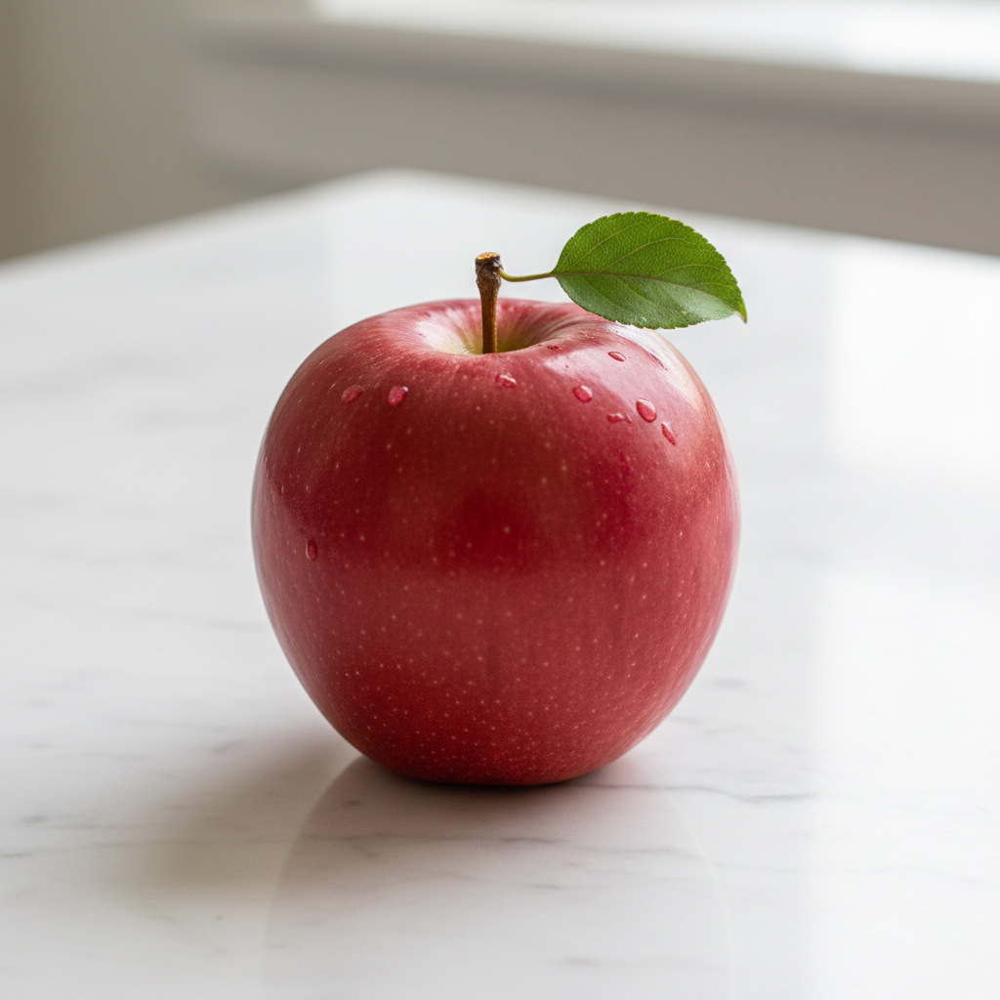

# ADK Rust MCP Toolkit

[](LICENSE)
[](https://www.rust-lang.org/)
[](https://modelcontextprotocol.io/)

Production-ready Model Context Protocol (MCP) servers for generative media, built in Rust. Generate images, videos, music, and speech through a unified, provider-agnostic interface.

## Features

- **🖼️ Image Generation** — Text-to-image with Imagen 3 and Gemini multimodal models
- **🎬 Video Generation** — Text-to-video, image-to-video, video extension with Veo 3.1
- **🎵 Music Generation** — Full songs with Lyria 3 Pro/Clip, real-time streaming with Lyria RealTime
- **🗣️ Speech Synthesis** — High-quality TTS with Chirp3-HD and Gemini voices (30 voices, 70+ languages)
- **🎛️ Media Processing** — FFmpeg-powered audio/video manipulation
- **🔌 Multiple Transports** — Stdio, HTTP, and SSE for any integration scenario
- **🔑 Dual API Support** — Works with both Vertex AI (ADC) and Gemini API (API key)

## Example Outputs

<table>
<tr>
<td align="center"><strong>Image Generation</strong></td>
<td align="center"><strong>Multimodal</strong></td>
</tr>
<tr>
<td></td>
<td></td>
</tr>
</table>

### 🎬 Video Generation

https://github.com/user-attachments/assets/video_test.mp4

<video src="docs/assets/video_test.mp4" width="640" controls></video>

### 🎵 Music Generation

<audio controls src="docs/assets/music_test.mp3">
  <a href="docs/assets/music_test.mp3">Download music sample</a>
</audio>

### 🗣️ Speech Synthesis

<audio controls src="docs/assets/speech_test.wav">
  <a href="docs/assets/speech_test.wav">Download speech sample</a>
</audio>

## Servers

| Server | Description | Tools |
|--------|-------------|-------|
| [`adk-rust-mcp-image`](adk-rust-mcp-image/) | Image generation & upscaling | `image_generate`, `image_upscale` |
| [`adk-rust-mcp-video`](adk-rust-mcp-video/) | Video generation | `video_generate`, `video_from_image`, `video_extend` |
| [`adk-rust-mcp-music`](adk-rust-mcp-music/) | Music generation & real-time streaming | `music_generate`, `music_realtime_start`, `music_realtime_steer`, `music_realtime_stop` |
| [`adk-rust-mcp-speech`](adk-rust-mcp-speech/) | Text-to-speech | `speech_synthesize`, `speech_list_voices` |
| [`adk-rust-mcp-multimodal`](adk-rust-mcp-multimodal/) | Gemini multimodal | `multimodal_image_generate`, `multimodal_speech_synthesize`, `multimodal_list_voices` |
| [`adk-rust-mcp-avtool`](adk-rust-mcp-avtool/) | FFmpeg processing | `ffmpeg_*` (8 tools) |

## Quick Start

### Prerequisites

- Rust 1.85+ (2024 edition)
- Google Cloud project with Vertex AI enabled, **or** a Gemini API key
- `gcloud` CLI authenticated (for Vertex AI)
- FFmpeg (for avtool only)

### Installation

```bash
# From crates.io
cargo install adk-rust-mcp-image adk-rust-mcp-video adk-rust-mcp-music \
              adk-rust-mcp-speech adk-rust-mcp-multimodal adk-rust-mcp-avtool

# Or build from source
git clone https://github.com/zavora-ai/adk-rust-mcp-toolkit
cd adk-rust-mcp-toolkit
cargo build --release
```

### Configuration

```bash
# Option 1: Gemini API (recommended for getting started)
export GEMINI_API_KEY=your-api-key  # from https://aistudio.google.com/apikey

# Option 2: Vertex AI (for production/enterprise)
export PROJECT_ID=your-gcp-project
export LOCATION=us-central1
export GCS_BUCKET=your-bucket  # Required for video generation on Vertex
```

The servers auto-detect which API to use: if `GEMINI_API_KEY` is set, they use the Gemini API; otherwise they use Vertex AI with Application Default Credentials.

### Run a Server

```bash
# Stdio (default) — for Claude Desktop, Kiro, local tools
adk-rust-mcp-image

# HTTP — for web apps, remote clients, ADK agents
adk-rust-mcp-image --transport http --port 8080

# SSE — for streaming applications
adk-rust-mcp-image --transport sse --port 8080
```

## Integration

### Kiro

Add to `.kiro/settings/mcp.json`:

```json
{
  "mcpServers": {
    "adk-image": {
      "command": "adk-rust-mcp-image",
      "args": ["--transport", "stdio"],
      "cwd": "/path/to/workspace",
      "env": {
        "PROJECT_ID": "your-project",
        "LOCATION": "us-central1"
      }
    }
  }
}
```

> **Note:** The `cwd` field is required for file output with relative paths.

### Claude Desktop

Add to `~/.config/claude/claude_desktop_config.json`:

```json
{
  "mcpServers": {
    "image": {
      "command": "adk-rust-mcp-image",
      "env": { "PROJECT_ID": "your-project" }
    }
  }
}
```

### HTTP Client (Rust)

```rust
use adk_tool::McpHttpClientBuilder;

let toolset = McpHttpClientBuilder::new("http://localhost:8080/mcp")
    .timeout(Duration::from_secs(120))
    .connect()
    .await?;
```

<details>
<summary><strong>Full Multi-Server Configuration</strong></summary>

```json
{
  "mcpServers": {
    "adk-image": {
      "command": "adk-rust-mcp-image",
      "args": ["--transport", "stdio"],
      "cwd": "/workspace",
      "env": { "PROJECT_ID": "my-project", "LOCATION": "us-central1", "GCS_BUCKET": "my-bucket" }
    },
    "adk-video": {
      "command": "adk-rust-mcp-video",
      "args": ["--transport", "stdio"],
      "cwd": "/workspace",
      "env": { "PROJECT_ID": "my-project", "LOCATION": "us-central1", "GCS_BUCKET": "my-bucket" }
    },
    "adk-music": {
      "command": "adk-rust-mcp-music",
      "args": ["--transport", "stdio"],
      "cwd": "/workspace",
      "env": { "PROJECT_ID": "my-project", "LOCATION": "us-central1" }
    },
    "adk-speech": {
      "command": "adk-rust-mcp-speech",
      "args": ["--transport", "stdio"],
      "cwd": "/workspace",
      "env": { "PROJECT_ID": "my-project" }
    },
    "adk-multimodal": {
      "command": "adk-rust-mcp-multimodal",
      "args": ["--transport", "stdio"],
      "cwd": "/workspace",
      "env": { "PROJECT_ID": "my-project", "LOCATION": "us-central1" }
    },
    "adk-avtool": {
      "command": "adk-rust-mcp-avtool",
      "args": ["--transport", "stdio"],
      "cwd": "/workspace"
    }
  }
}
```

</details>

## Architecture

```
┌─────────────────────────────────────────────────────────────┐
│                     MCP Servers                              │
│  image │ video │ music │ speech │ multimodal │ avtool       │
├─────────────────────────────────────────────────────────────┤
│                  adk-rust-mcp-common                         │
│         Config │ Auth │ GCS │ Transport │ Tracing           │
├─────────────────────────────────────────────────────────────┤
│                  Provider Abstraction                        │
├──────────────┬──────────────┬──────────────┬────────────────┤
│   Google     │    AWS       │   Azure      │    Local       │
│  Vertex AI   │  Bedrock     │  OpenAI      │   Ollama       │
│  Cloud TTS   │   Polly      │   TTS        │   Whisper      │
│   Gemini     │   Nova       │   GPT-4o     │                │
└──────────────┴──────────────┴──────────────┴────────────────┘
```

**Currently Implemented:** Google Cloud (Vertex AI, Cloud TTS, Gemini)

**Planned:** AWS Bedrock, Azure OpenAI, local/self-hosted models

## Documentation

| Resource | Description |
|----------|-------------|
| [Configuration Guide](docs/configuration.md) | Environment variables, authentication |
| [API Reference](docs/api/) | Tool parameters and responses |
| [Server Guides](docs/servers/) | Per-server documentation |
| [Development Guide](docs/development.md) | Contributing, testing, architecture |
| [Examples](examples/) | ADK agent integration examples |

## Testing

```bash
# Unit tests
cargo test --workspace

# Integration tests (requires GCP credentials)
cargo test --workspace --test integration_test

# Skip integration tests
SKIP_INTEGRATION_TESTS=1 cargo test --workspace
```

## Contributing

See [CONTRIBUTING.md](CONTRIBUTING.md) for development setup and guidelines.

## Security

See [SECURITY.md](SECURITY.md) for reporting vulnerabilities.

## License

Apache-2.0 — see [LICENSE](LICENSE) for details.

---

Built with ❤️ by [Zavora AI](https://zavora.ai)
